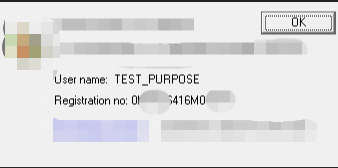

# A keygen for an encryption method

*All work done in this repo is just for study purposes, the major salt value is changed!*

*The program will not be public available, please support all developers' hard work.*

## A story about this keygen

I've been studying reverse engineering for a while, and this is the first program that I reversed by myself. 

Though debugging asm codes are pretty ~boring~ time consuming, I learnt how low architecture encrypted and by

 going through the asm code I could write out the first ever keygen.
